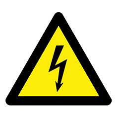

# FIRST STEPS WITH MARKDOWN <!-- omit in toc -->

Powder Peparator

## **Table of contents**

- [**Table of contents**](#table-of-contents)
- [**1. About**](#1-about)
  - [1.1 Help](#11-help)
- [2. Highlighting and other](#2-highlighting-and-other)
- [3. Links](#3-links)
- [4. Pictures](#4-pictures)
- [5. Lists](#5-lists)
- [6. Table](#6-table)

  
## **1. About**

This manual provides all the information needed to use and service your Sinterit Powder Separator.  
Good operation and durability depend on proper maintenance and careful use.

### 1.1 Help

Before leaving the factory, this particular model has undergone thorough tests to ensure the utmost reliability.  However, make sure that the powder separator has not been damaged during transport in a way that could affect its operation and safety.  This manual should be considered an integral part of the powder separator and must be kept together with the unit this is scrapped.  
In case of loss or damage to the manual, ask Sinterit for a new copy or visit www.sinterit.com/support/ and download the PDF.
This manual provides all the information needed to use and service your Sinterit Powder Separator.  
Good operation and durability depend on proper maintenance and careful use.


## 2. Highlighting and other

*In case of loss or damage* to the manual, ask Sinterit for a new copy or **visit** www.sinterit.com/support/ and download the PDF.


> This manual provides all the information needed to use and service your Sinterit Powder Separator.

operation:

`x+y=z`

```started_in = os.getcwd()
    download_content(terminology_url, terminology_languages)
    os.chdir(started_in)
```

new operation:
```
X+Y=Z
```

## 3. Links

[pogoda](www.meteo.pl)

[www.meteo.pl]

## 4. Pictures


## 5. Lists
1. Pierwszy rozdział
2. Drugi rozdział

- jeden
- dwa
- trzy

## 6. Table

This is an example table.

|column 1|Column 2|
|---------|---------|
|  explosion protection|    electroshock  |
|||


    


[def]: #table-of-contents