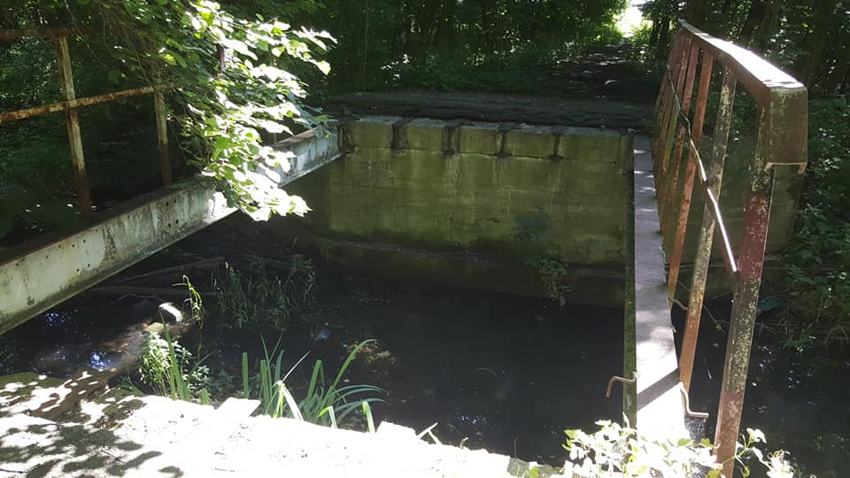

# tytuł <!-- omit in toc -->

Powder Peparator


## chapter 1

**About**

This manual provides all the information needed to use and service your Sinterit Powder Separator.  
Good operation and durability depend on proper maintenance and careful use.

### chapter3

Before leaving the factory, this particular model has undergone thorough tests to ensure the utmost reliability.  However, make sure that the powder separator has not been damaged during transport in a way that could affect its operation and safety.  This manual should be considered an integral part of the powder separator and must be kept together with the unit this is scrapped.  
In case of loss or damage to the manual, ask Sinterit for a new copy or visit www.sinterit.com/support/ and download the PDF.
This manual provides all the information needed to use and service your Sinterit Powder Separator.  
Good operation and durability depend on proper maintenance and careful use.


## Wyróżnianie

*In case of loss or damage* to the manual, ask Sinterit for a new copy or **visit** www.sinterit.com/support/ and download the PDF.


> This manual provides all the information needed to use and service your Sinterit Powder Separator.

operation:

`x+y=z`

```started_in = os.getcwd()
    download_content(terminology_url, terminology_languages)
    os.chdir(started_in)
```

new operation:
```
X+Y=Z
```

## Odsyłacze

[pogoda](www.meteo.pl)

[www.meteo.pl]

## Obrazki



## Listy

1. Pierwszy rozdział
2. Drugi rozdział

- jeden
- dwa
- trzy

## Tabele

To jest przykładowa tabelka

|kolumna 1|Kolumna 2|
|---------|---------|
|bla bla  |bla bla  |
|hehe     | hehe    |

Spis treści

- [chapter 1](#chapter-1)
  - [chapter3](#chapter3)
- [Wyróżnianie](#wyróżnianie)
- [Odsyłacze](#odsyłacze)
- [Obrazki](#obrazki)
- [Listy](#listy)
- [Tabele](#tabele)
  
    

